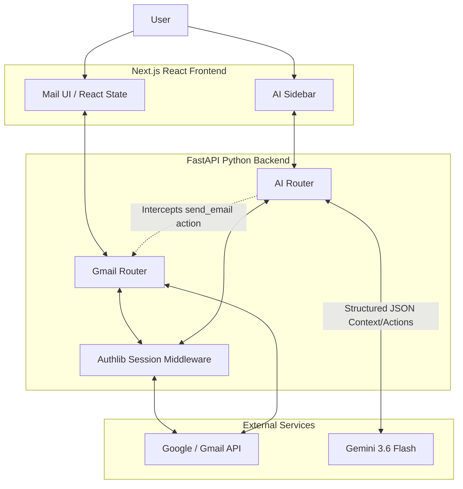

#  Nebula Mail AI

Nebula Mail AI is an intelligent, modern email web application built as a hiring task submission. It directly integrates with the real **Gmail API** and embeds a **Context-Aware AI Assistant** (powered by Google Gemini) that can understand natural language, read the email you are currently viewing, and take physical control of the UI to draft and send emails on your behalf.

---

##  Actual Implemented Features

### Core Mail Functionality
* **Gmail Integration:** Authentic Google OAuth 2.0 flow. Fetches real emails directly from your Gmail account.
* **Inbox & Sent Folders:** View and browse your emails effortlessly.
* **Email Reading:** Safely parses and renders multipart MIME emails (including rich HTML emails) using `isomorphic-dompurify` to prevent XSS attacks while preserving formatting.
* **Compose & Reply:** Full manual support for drafting new emails or threading replies directly into original Gmail conversations.

###  AI Assistant with UI Control
The AI in this application doesn't just return text—it interacts with the application state.
* **Context Awareness:** The frontend continually feeds the AI your current view state (e.g., "User is currently looking at Email ID X from Y"). 
* **Live UI Manipulation:** When asked to compose or reply, the AI outputs a strict JSON schema containing a `ui_action`. The React frontend parses this and *physically navigates your screen* to the Compose tab, automatically populating the `To`, `Subject`, and `Body` fields.
* **Human-in-the-Loop Backend Execution:** The AI is strictly prohibited from claiming an email was sent until it physically is. When you confirm a draft (e.g., "Yes, send it"), the AI outputs a `backend_action`. The FastAPI backend intercepts this, validates your OAuth token, generates the MIME payload, calls the Gmail API, and replaces the AI's response with absolute proof of success (the real Gmail Message ID).

---

## System Architecture



### Key Technical Decisions:
* **Frontend:** Built with **Next.js**, React, and Vanilla CSS. State is managed centrally in `app/page.tsx` to easily share context between the Mail UI and the AI Sidebar.
* **Backend:** Built with **FastAPI**. It handles complex MIME parsing and Gmail API token injection so the frontend remains clean and simple.
* **AI Integration:** Uses the new `google-genai` SDK with **Gemini 3.6 Flash**, leveraging `GenerateContentConfig(response_schema=...)` to force the LLM to output a precise Pydantic model (`AIResponseSchema`).

---

## Setup & Local Development

### 1. Prerequisites
- Node.js (v18+)
- Python (3.10+)
- A Google Cloud Console project with the Gmail API enabled and OAuth 2.0 credentials generated.
- A Gemini API Key from Google AI Studio.

### 2. Environment Variables
Create a `.env` file in the root of the project (next to `frontend` and `backend` directories) and populate it:

```env
# ==== FRONTEND ====
NEXT_PUBLIC_API_URL=http://localhost:8000

# ==== BACKEND ====
GOOGLE_CLIENT_ID="your_google_client_id.apps.googleusercontent.com"
GOOGLE_CLIENT_SECRET="your_google_client_secret"
GOOGLE_PROJECT_ID="your_project_id"

GEMINI_API_KEY="your_gemini_api_key"

CORS_ORIGINS=http://localhost:3000
```

### 3. Start the Backend (FastAPI)
Open a terminal in the root directory:
```bash
cd backend
python -m venv venv
source venv/bin/activate  # On Windows: .\venv\Scripts\activate
pip install -r requirements.txt
uvicorn main:app --reload
```
*The backend will run on `http://localhost:8000`.*

### 4. Start the Frontend (Next.js)
Open a new terminal in the root directory:
```bash
cd frontend
npm install
npm run dev
```
*The frontend will run on `http://localhost:3000`.*

---

## AI Assistant Examples to Try

**Example 1: Context-Aware Reply**
1. Click on any email in your Inbox to open it.
2. Type in the AI Assistant: *"Reply to this email saying: Thanks for the update, I'll review it shortly!"*
3. **Watch the UI:** The AI will automatically switch your view to Compose, fill in the original sender's email, prefix the subject with `Re:`, and type out the body.
4. Type: *"Yes, send it now."*
5. The AI will execute the backend action, send it via Gmail, and confirm success.

**Example 2: Cold Compose**
1. Type: *"Draft an email to john@example.com about our meeting tomorrow."*
2. The AI will populate the UI. You can manually tweak the text in the UI, then click the manual "Send" button, or just ask the AI to send it.

---

##  Known Limitations & Future Improvements

1. **AI Tool Scope:** The backend schema currently only intercepts and executes the `send_email` action. Directives like `search` and `open_email` are partially stubbed in the backend schema but are not yet wired up to transition state in the React frontend. Given more time, I would connect these so you could type *"Show me unread emails from David"* and have the UI switch to the inbox and filter automatically.
2. **HTML Sanitization:** `isomorphic-dompurify` strips out potentially malicious tags (like `<script>` and `<iframe>`). Standard HTML emails render beautifully, but highly complex promotional newsletters with exotic embedded stylesheets might lose some styling compared to the official Gmail client. This is a deliberate and necessary security tradeoff. 
3. **Pagination:** The Gmail API fetcher currently pulls the first 15 emails. Implementing a Next Page token system would be the next step for scale.
